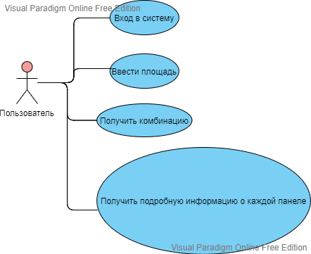
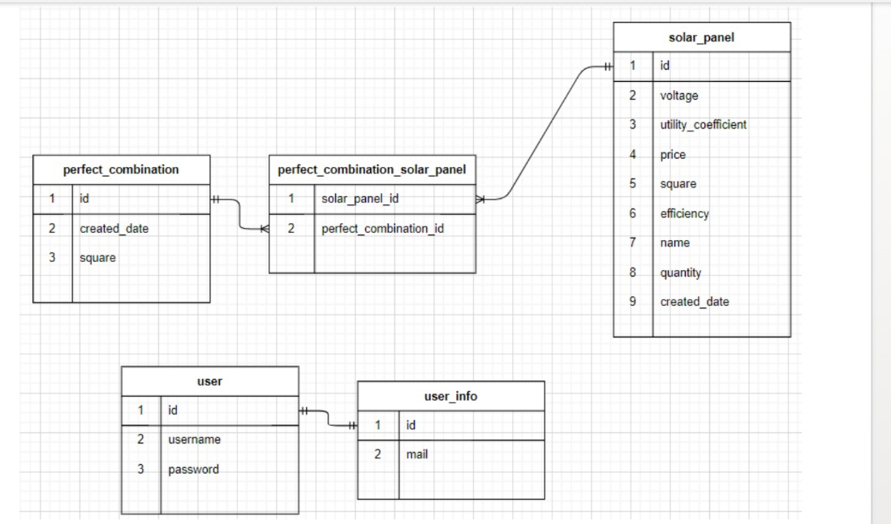

# Moscow Houses Map    
     
### Цель работы
Реализовать приложение для поиска оптимальной по цене и выроботке электроэнергии комбинации солнецных панелей

### Функциональные требования   
Пользователь заходит в приложение, вводит площадь, которую он может заставить солнечными панелями. Приложение выдает оптимальную комбинацию по электроэнергии и стоимости. после чего пользователь может отдельно посмотреть информацию по каждой панели.  

### User-Case   
     

### ER   

### Тестирование балансировки   
[apashe](apashe-res.md)
